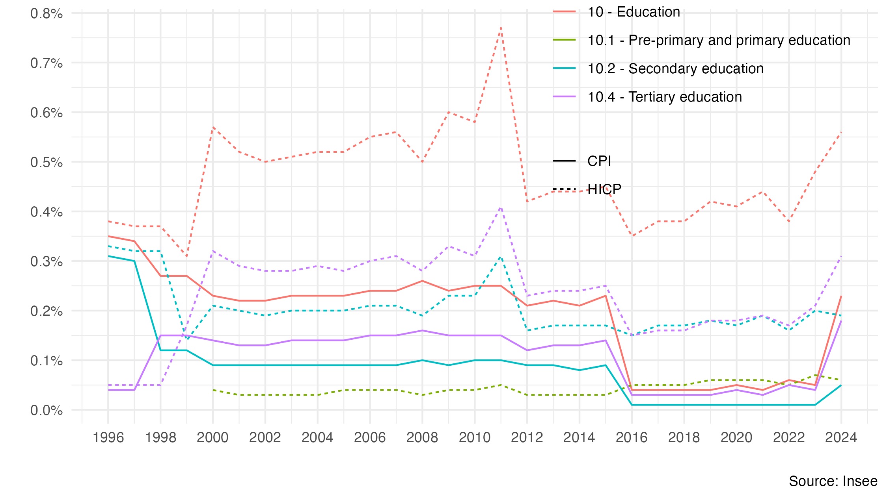

# Inflation in France: CPI or HICP?

This repository provides replication codes for the [linked note](https://fgeerolf.com/CPI-or-HICP.pdf), as well as tools to calculate constant euro evolutions based on the HICP rather than the CPI.

## Replication

The repository contains everything needed to replicate the figures and data from the [linked note](https://fgeerolf.com/CPI-or-HICP.pdf):

### Table 1. Inflation according to the CPI or the HICP

[R Code](table1.R)

### Figure 1. Weight and evolution of the healthcare index in the CPI and in the HICP.

[R Code](figure1.R)

### Figure 2. Evolution of annual wages “in constant euros” by socio-professional category, using CPI inflation and using HICP inflation

[R Code](figure2.R)

### Figure A1: Weight of education in the CPI and in the HICP

[Code R](figureA1.R)

### Figure A2: Purchasing power of the civil service net index point, CPI vs. HICP

[Code R](figureA2.R)

